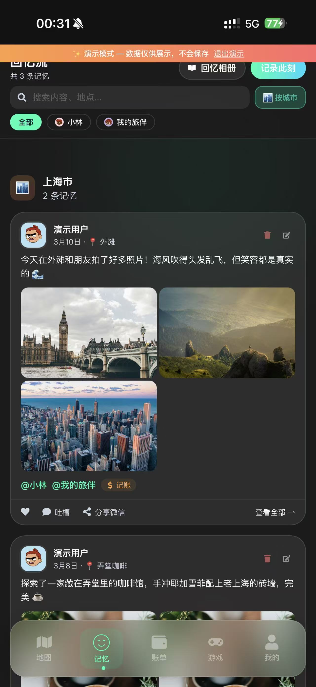
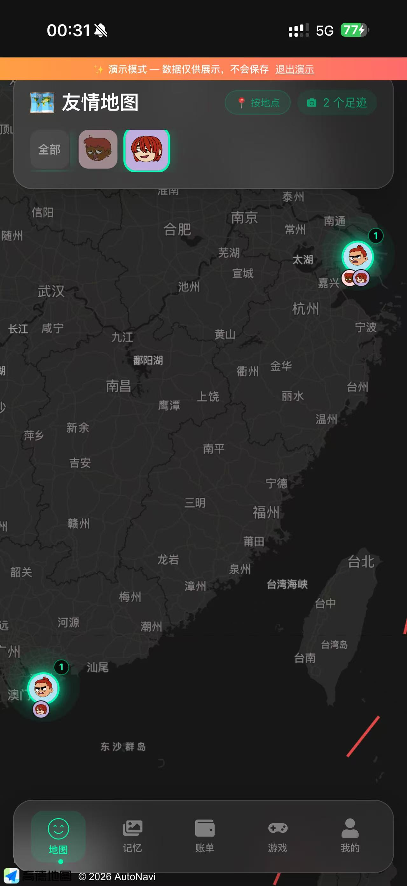
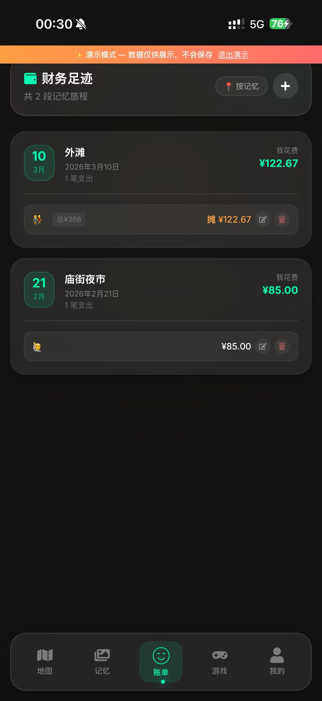
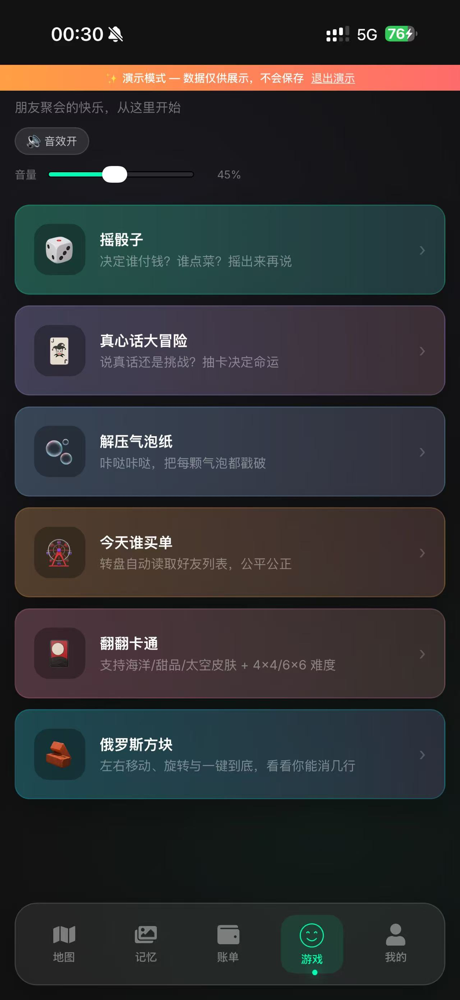
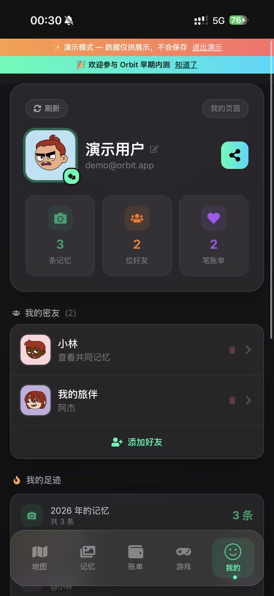

# 🌌 Orbit 轨迹（内部专用）

> ⚠️ **保密声明：本项目为私有资产，严禁擅自分发、二次拷贝或开源。**
> 如需向第三方进行代码评审或产品演示，请务必先脱敏核心数据，并征得项目负责人明确同意。

Orbit 是一款围绕 **“地图记忆 + 密友协作 + 轻量记账 + 破冰游戏”** 构建的移动端 PWA 应用。我们的核心愿景是：为熟人之间创造一个低摩擦、低打扰、高安全感的私密记录与共享空间。

---

## ✨ 核心产品模块

*(💡 提示：请将对应的项目截图放置在 `screenshot_app/` 目录下以正确渲染图片)*

### 1. 📖 记忆流 (Memory Stream)

- **全媒介记录**：支持照片、视频、最高 30 秒语音备忘、长文本、精确定位、天气与心情。
- **无缝协作**：@ 密友后双方流内同步展示；支持针对单条记忆的私密吐槽（评论）。
- **离线与降级**：支持无网环境下的离线排队与“仅 Wi-Fi 上传”策略，确保弱网不卡死。

### 2. 🗺️ 友情地图 (Friendship Map)

- **多维聚合**：基于高德地图 (AMap) 深度定制，支持按“城市聚类”或“精确地点”双重视角查看。
- **动态筛选**：顶部一键勾选好友，地图光点与底部回忆列表实时执行 `AND` 逻辑过滤。

### 3. 💰 财务足迹 (Ledger)

- **场景化记账**：发布记忆时可“顺便记账”，无缝衔接消费场景。
- **极度私密**：即使记忆中 @ 了好友且包含平摊账单，账单金额与明细也**仅自己可见**。

### 4. 🎮 破冰游戏 (Mini Games)

- **线下聚会利器**：内置摇骰子、今天谁买单（转盘）、真心话大冒险、解压气泡纸等 6 款轻互动。
- **Web Audio 引擎**：纯代码实时合成 8-bit 电子音效，脱离笨重的媒体文件依赖。

### 5. 🏠 个人主页与社交关系

- **灵活的关系链**：支持邀请码建立真实羁绊；也支持先创建“虚拟好友”占位，待对方注册后自动绑定并继承所有历史记忆标签。

---

## 🛠️ 技术架构

- **前端框架**：React 18 + TypeScript + Vite
- **UI & 动效**：Tailwind CSS + Framer Motion
- **状态管理**：Zustand
- **后端与存储**：Supabase (Auth / PostgreSQL / Storage)
- **地图服务**：AMap (高德地图 Web API)
- **PWA 支持**：vite-plugin-pwa (Service Worker + 离线缓存)
- **原生打包**：Capacitor (一键生成 iOS / Android 壳)

---

## 🚀 本地开发指南

环境要求：Node.js 18+，npm 9+

```bash
# 1. 依赖安装
npm install

# 2. 启动本地开发服务器
npm run dev

# 3. 生产环境预览 (测试构建产物)
npm run build
npm run preview

# 📱 原生壳调试 (Capacitor)
npm run cap:sync     # 同步最新的 web 产物到原生目录
npm run ios:open     # 打开 Xcode
npm run android:open # 打开 Android Studio
```

---

## 🗄️ 数据库与数据安全

- 核心表：profiles, friendships, memories, memory_tags, memory_comments, ledgers。
- RLS 原则：
  - 记忆与评论：仅“作者”或“被标记且互为已接受好友”可见。
  - 评论删除：仅评论作者或该记忆作者可删。
  - Storage：photos/avatars/videos 桶仅认证用户可写。
- ⚠️ 迁移脚本警告：`friend-requests-migration.sql`, `memory-comments-migration.sql` 等需在 Supabase SQL Editor 按需执行。切勿在生产运行包含 `DROP TABLE ... CASCADE` 的初始化脚本，除非明确要删档重置。

---

## 📁 目录结构速览

```text
orbit/
├── src/
│   ├── api/            # Supabase API 封装
│   ├── components/     # UI 组件
│   ├── pages/          # 地图/记忆/账单/游戏/我的
│   ├── store/          # Zustand 状态切片
│   ├── styles/         # 全局样式与 Tailwind 主题
│   └── utils/          # 工具类（网络监测、Web Vitals 埋点等）
├── supabase/           # SQL 迁移脚本与 DB 配置
├── public/             # 静态资源与 offline.html
├── docs/               # 内部文档与设计资产
├── screenshot_app/     # 产品截图（请放置 README 引用的图片）
└── README.md
```

---

## 🎯 PWA 演进与落地清单

**目标：** 打造接近原生 App 体验（可安装、快启动、离线可用、系统级交互）。

### ✅ P0：基础设施
- [x] manifest 元数据
- [x] PWA 图标资源 (192x192, 512x512)
- [x] Service Worker 自动更新 (registerType: autoUpdate)
- [x] 离线兜底页 (public/offline.html)
- [x] 安装引导 UI (beforeinstallprompt)
- [x] LCP/CLS/INP 自动化采集（`window.exportOrbitWebVitalsBaseline()`）

### 🚧 P1：体验护城河（当前迭代）
- [x] 核心接口 NetworkFirst + fallback
- [x] 写操作弱网/离线拦截与提示
- [x] 新版本就绪提示条（点击刷新）
- [x] iOS / Android 安装引导
- [ ] 离线模式信息架构（无缓存页的跳转阻断）

### 🔮 P2：原生级增强（规划）
- [ ] 系统级推送通知闭环（好友申请 / 账单提醒）
- [ ] Background Sync（发布失败自动重试）
- [ ] manifest 商店截图完善
- [ ] Lighthouse PWA 分数 >= 90

### 验收标准
- 3 步内完成“添加到主屏幕”
- 刷新 / 重启无登录态卡死或白屏
- 断网进入 offline.html，不崩溃
- 新版本 1 次刷新完成升级
- Lighthouse PWA 要点全部通过

---

## 📅 近期已上线功能

- 好友申请流：发送 / 接受 / 拒绝 + 红点提醒
- 虚拟好友绑定真实账号：历史 `memory_tags` 无缝继承
- 双向好友关系自动补全，确保互可见
- 游戏模块 5 款主力玩法 + 8-bit 音效
- Demo 模式与 UUID 防护

---

## License

本项目当前未声明开源协议；如需开源，建议补充 MIT 或 Apache-2.0。 
