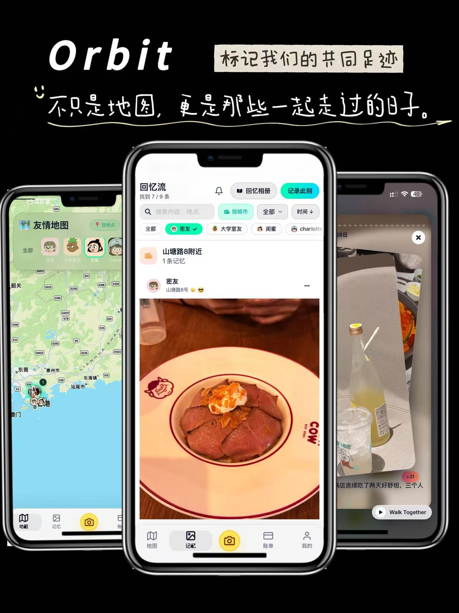
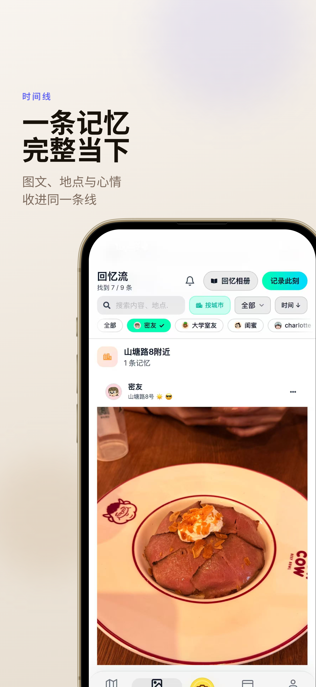
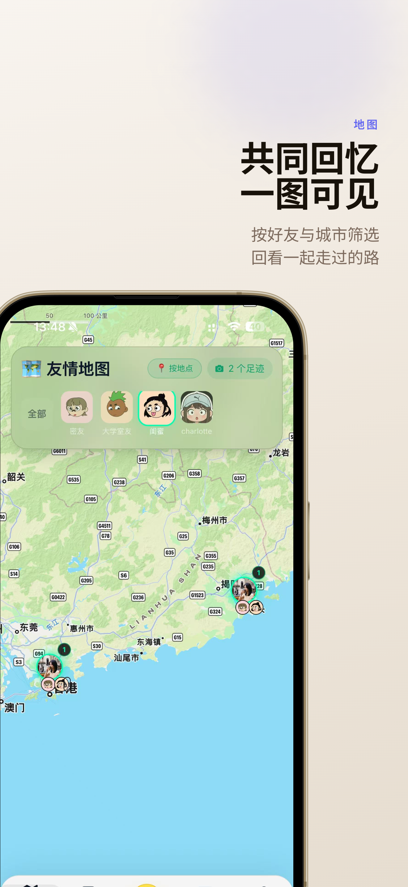
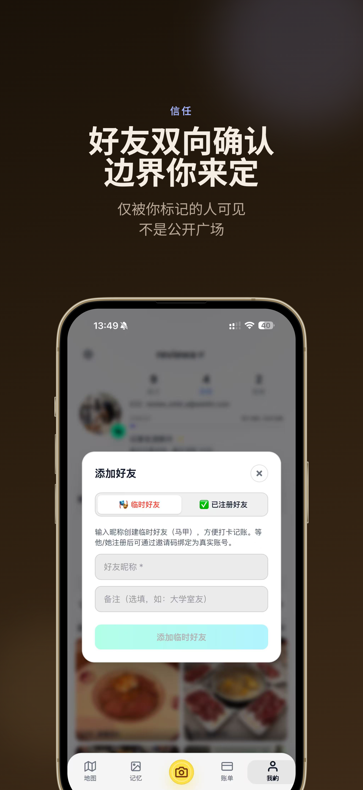
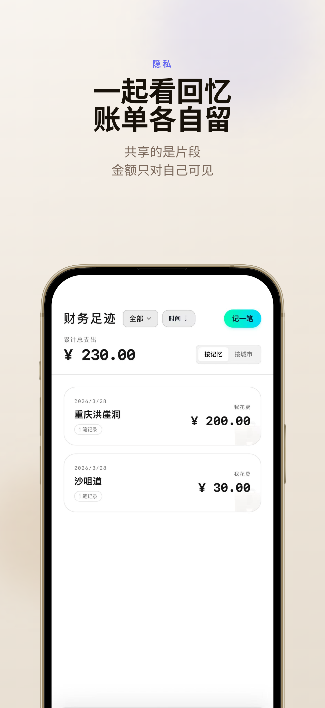
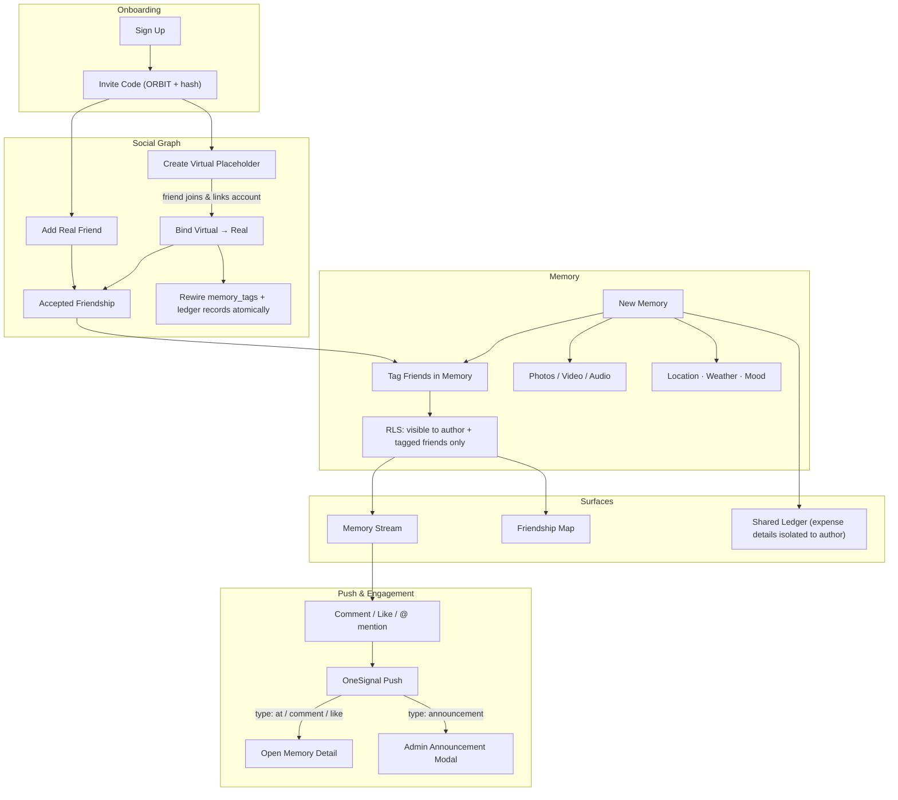

# Orbit 轨迹

> A private mobile app for recording and sharing memories with close friends — built with React, TypeScript, and Capacitor.

**Website:** [wehihi.com](https://wehihi.com) · **Platform:** iOS & Web · **Contact:** support@wehihi.com



---

## Overview

Orbit is a memory-first social app designed for small, trusted circles. Unlike public social networks, every memory is tag-based and visible only to the people explicitly included. The app combines memory logging, a friendship map, and shared expense tracking into a single cohesive experience.

**Live demo (web):** [wehihi.com](https://wehihi.com)

---

## Screenshots

| Memory Stream | Friendship Map | Friend Privacy |
|---|---|---|
|  |  |  |

| Ledger Privacy | | |
|---|---|---|
|  | | |

---

## How It Works



---

## Features

**Memory Stream**
Record moments with photos, video, long-form text, precise location, weather, mood, and route tags. Tag friends to share a memory with them directly in their feed. Participants can leave text or voice comments (up to 30s). Memories can also be browsed in a full-screen story album view with poster generation.

**Friendship Map**
All geotagged memories are plotted on an interactive map (Apple Maps (MapKit JS)). Filter by friend to see a shared travel history, or zoom out to see city-level clusters.

**Shared Ledger**
Log expenses alongside a memory or independently. Expense details are always private to the author only — tagged friends see the memory but never the associated numbers. AA splits can be set up with selected participants.

**Friend System**
Friends are added via invite code through a mutual confirmation flow (send request → accept/reject). Memories use a tag-based visibility model: a memory is only visible to its author and the friends explicitly tagged in it — being friends alone does not grant access to someone's memories. Virtual friend placeholders can be created for contacts who haven't registered yet; once they join and link their account via invite code, all historical memory tags and expense records transfer automatically. Removing a friend downgrades your account to a virtual placeholder on their side; any memories where they were tagged remain accessible to them until you manually remove the tag or delete the memory.

---

## Tech Stack

| Layer | Technology |
|---|---|
| Frontend | React 18, TypeScript, Vite |
| Styling & Animation | Tailwind CSS, Framer Motion |
| State Management | Zustand |
| Backend & Database | Supabase (Auth, PostgreSQL, Storage, Edge Functions) |
| Maps | Apple MapKit JS |
| Native Shell | Capacitor (iOS) |
| Push Notifications | OneSignal |
| Deployment | Vercel |
| Monitoring | Aegis Web SDK (Tencent Cloud), Vercel Analytics |

---

## Technical Highlights

**WKWebView session recovery**
Implemented a custom `authAwareFetch` wrapper that bypasses the WebView's stale HTTP stack after the app returns from background. The bearer token is injected directly from `localStorage` instead of going through `supabase.auth.getSession()`, avoiding lock contention that caused silent auth failures on resume.

**Virtual-to-real account binding**
When a virtual friend placeholder is bound to a real registered user, all `memory_tags`, friendship records, and expense entries are atomically rewired from the virtual ID to the real user ID. Historical memories become live and interactive for the newly linked user without any data loss.

**Tag-based memory visibility via RLS**
Memories are scoped to the author and explicitly tagged friends through Postgres Row Level Security policies. Friendship alone does not grant read access — visibility is per-memory, per-tag. Unfriending gracefully degrades: the unfriended user's tag becomes a virtual placeholder rather than exposing or breaking existing records.

**Native chunked upload**
Built a custom `NativeUploader` Capacitor plugin that streams large video and audio files as base64 chunks directly to Supabase Storage, bypassing the WKWebView heap limit that causes silent JS stack overflows on files above ~20 MB.

**Tiered foreground resume strategy**
App wake-up behavior varies by background duration and network type: short absence skips heavy refresh, medium absence triggers partial hydration, long absence forces a full session refresh and data reload. Network type (WiFi / cellular / offline) is checked via Capacitor Network API to gate upload and sync operations.

**Push deep linking and admin announcement modals**
Notification taps are routed by `additionalData.type` to the correct in-app destination (memory detail, friend request, etc.). Admin broadcast notifications carry a separate `announcement` type that triggers a modal overlay on open rather than a navigation event, ensuring important messages are seen regardless of current app state.

---

## Project Structure

```
oribit/
├── src/
│   ├── api/              # Supabase client & API wrappers
│   ├── components/       # Shared UI components
│   ├── constants/        # App-wide constants (legal documents, etc.)
│   ├── pages/            # Route-level pages (Map, Memory, Ledger, Profile)
│   ├── store/            # Zustand state slices
│   ├── types/            # TypeScript type definitions
│   └── utils/            # Helpers (settings, network, tag visibility)
├── ios/                  # Capacitor iOS project
├── supabase/             # Edge Functions & SQL migration scripts
├── public/               # Static assets, PWA manifest, privacy policy
└── docs/                 # Internal documentation
```

---

## Local Development

**Requirements:** Node.js 18+, npm 9+

```bash
# Install dependencies
npm install

# Start dev server
npm run dev

# Production build
npm run build

# Sync web build to native shell (Capacitor)
npm run cap:sync

# Open in Xcode
npx cap open ios
```

Environment variables (copy `.env.example` to `.env`):

```
VITE_SUPABASE_URL=
VITE_SUPABASE_ANON_KEY=
VITE_APPLE_MAPKIT_TOKEN=
VITE_ONESIGNAL_APP_ID=
```

---

## Database

Core tables: `profiles`, `friendships`, `memories`, `memory_tags`, `memory_comments`, `memory_likes`, `ledgers`, `ledger_participants`, `notifications`, `reports`.

Row Level Security (RLS) is enabled on all tables. Key rules:
- Memories are visible only to their author and explicitly tagged friends.
- Comments are visible only to participants of the parent memory.
- Storage buckets (photos, avatars, videos) are write-restricted to authenticated users.
- Banned users are blocked from write operations via RLS policies.

Migration scripts in `supabase/` and the project root (`*.sql`) should be run in the Supabase SQL Editor.

---

## Privacy & Legal

- Privacy Policy: [wehihi.com/privacy](https://wehihi.com/privacy/)
- Data is stored on Supabase infrastructure (US region).
- The app does not use advertising SDKs or sell user data.

---

## License

© 2026 Yan Rong. All rights reserved.  
Source code is made available for portfolio review purposes only. Redistribution, copying, or commercial use is not permitted without explicit written permission.
